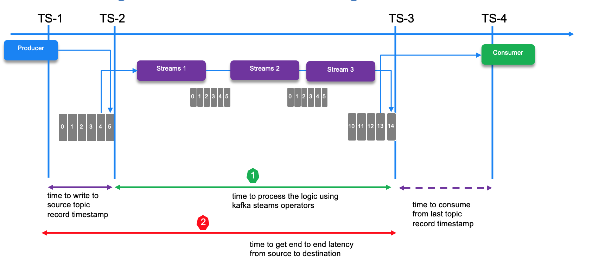
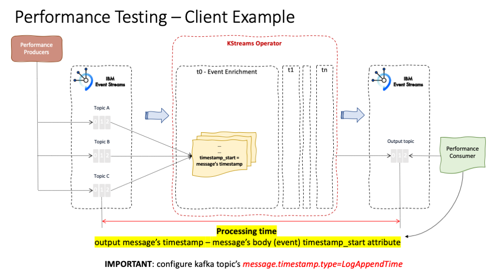

# Different tools for EDA project

This repository includes different tools to be used for testing or code to support the EDA bootcamp labs.

## Labs

* [Event Streams Managed service on cloud]()

## Latency measurement

To measure latency we need to get the timestamp of the input record at the first topic and the timestamp at the record from the last topic. The following diagram presents the different timestamps and latency goals we want to measure:

* TS1: is a timestamp added to the record creation time. If the user did not provide a timestamp, the producer will stamp the record with its current time. The timestamp eventually used by Kafka depends on the timestamp type configured for the topic. If the topic is configured to use `CreateTime`, the timestamp in the producer record will be used by the broker. If the topic is configured to use `LogAppendTime`, the timestamp in the producer record will be overwritten by the broker with the broker local time when it appends the message to its log.
* TS2: is available only if the input topic uses the append log time stamp, or it will be TS1 otherwise.
* TS3: is the append log time stamp, on last output topic
* TS4: is a time stamp at runtime around the poll method of the consumer code. This may not be a relevant timestamp if we focus just on the delivery to topic.TS4-TS3 is really dependant of the consumer runtime processing a loading logic: for example a records in the topic could have been persisted with a timestamp of two days ago, the consumer will load it and see a latency of two days. For performance testing we encourage to start the consumer before the producer and load from the latest offset, be part of its unique consumer group, and auto commit read offset.

It is important to agree on what is the expected latency to measure: arrow 1 or 2 in previous figure. The difference between TS3 and TS4 is variable and depends on when the consumer starts and the processing done. So the relevant latency measures could be (TS3 - TS1) or (TS3 - TS2).

If we need to measure the latency we need to have the TS1 or TS2 timestamp propagated to the last output topic or configure the consumer to poll from the first topic and the last topic and use a correlationID to compute the latency.

As an alternate the TS1 needs to be in the payload:

Finally in the case of data replication between data centers using tool like MirrorMaker 2, the timestamps have the same meaning but developer has less control on managing the timestamps. 

To measure latency between TS2 and TS3 we need to get a consumer to poll from both topics in different cluster, or use TS1 = TS2 and has to be injected by the producer in the payload.

Those timestamps are per message, so a performance monitoring tool needs to keep measurement per message. The injection of a correlation ID is needed to get a latency view per message. The consumer may includes multiple consumers or one that listen to all topic/partitions from the output topic, as the goal is to aggregate the min, max, average measured latency.

## Kafka performance considerations

As a distributed processing and persistent system, Kafka is not an easy beast for assessing throughput and scalability. We will try to summaryze our studies in this section. Some kafka deployments are able to process 30+ millions events per second... so how to do that?

* Latency and throughput are orthogonal dimension: Understand the needs for both, and the type of application traffic: near real time, real time processing, data reliability...
* Data reliability impacts performance: number of replicas and acknowledge level
* The characteristics of the producer settings impact performance: Acknowledge level, transactional, buffer size
* The topic configuration, replication, fetching characteristics...
* Typical cluster side is around 20 brokers in average from 3 to 50 brokers. Ingestion can reach 4GB / s at peak volumes.
* Producer can use partition affinity to avoid having too many TCP connection to brokers
* Producer can be multi threaded
* Consider looking at the disk used to persist, be sure for example that each nodes on which the brokers run have different hardware driver, mounted in separate directory.
* Disk has a direct impact on throughput. Kafka always immediately writes all data to the filesystem and supports the ability to configure the flush policy that controls when data is forced out of the OS cache and onto disk using the flush. Having more disks per broker increase throughput.
* Increasing partitions help to scale the consumer processing: each consumer thread read from one partition, if the number of thread equals the number of partition. Increasing the partition density adds an overhead related to metadata operations and per partition request/response between the partition leader and its followers. Replicas follower fetching data from the leader enforces consuming processing for the partition leader while it is also serving other consumers.  
* Monitor CPU utilization of each brokers and each consumer / producer apps

### Producer

For the producer the following parameters impact throughtput and latency:

* Tuning the batch.size as increasing batch size could result in higher throughput. A 512kB gives good result for getting around 1.5GB throughput.
* linger: when records comes from external source, the producer could groups records in the batch, but publishes once the delay goes over the `linger.ms` settings. In low-load scenarios, this improves throughput by sacrificing latency.
* The level of expected acknowledge: `All` means the partition leader waits for all in-sync replicas to acknowledge the leader before a write request is considered completed. `All` impacts latency and lower throughput.
* `buffer.memory` The total bytes of memory the producer can use to buffer records waiting to be sent to the server. Set close to the total memory of the producer.

[See producer configuration from Kafka doc](https://kafka.apache.org/documentation/#producerconfigs)

### Kafka streams

Kafka streams ensures exactly once semantics, so this add to latency quite significently. This means the following configuration is used:

* Acknowledge All
* Replicas 3 with in-synch replicas 2
* Idempotence is set to true
* The number of in-flight request per connection is 1
* As producer write to topic with multiple partition in the same batch, all records are saved or none are.
* When consuming messages, only committed messages are polled.

Do not expect linear scaling with chained kafka streams operations/process.

### Schema registry

When using AVRO schema for the payload, verify the producer and consumer cache the schema definition once read from the registry: round trip to get the message will cost time.

## Simple test framework

* Use kafka connect to send data and Null Sink to read and commit offset from output topic

TBC

## Performance test tool in Java

Considering looking at the producer and consumer heap size. 
Revisit the garbage collection settings. Remember that GC impact latency as the JVM is paused while doing GC. As a core principle, the more memory you give the JVM, the lower the collection frequency. The more you have short lived object the higher the cost of GC reclamation.

* Heap size control: -Xmx for maximum heap size and -Xms for heap mem start size
* -XX:+UseG1GC   : This is the default GC for the JVM for JRE 9+ so set this one if you use JRE 8. G1 GC helps to keep good throughput.
* -XX:MaxGCPauseMillis= ? :  sets the peak pause time expected, longer pause increase latency and throughput.
* -XX:InitiatingHeapOccupancyPercent= 35 : Sets the Java heap occupancy threshold that triggers a marking cycle. The default occupancy is 45 percent of the entire Java heap.
* -XX:G1HeapRegionSize= ?  he size of a G1 region
* -XX:XX:MetaspaceSize= ? -XX:MinMetaspaceFreeRatio= ? and -XX:MaxMetaspaceFreeRatio= ?: hold class metadata. *MetaspaceSize*: Sets the size of the allocated class metadata space that will trigger a garbage collection the first time it is exceeded. *MinMetaspaceFreeRatio* o make Metaspaces grow more agressively, and *XX:MaxMetaspaceFreeRatio* to reduce the chance of Metaspaces shrinking

## Performance test tool in Python

**Check its readme file [here](test-tools/python/README.md)**

## Source of information

* [Monitoring kafka - product documentation](https://kafka.apache.org/documentation/#monitoring)
* [Garbage First Garbage Collector Tuning](https://www.oracle.com/technical-resources/articles/java/g1gc.html)
* [Monitoring Kafka at scale with Splunk](https://www.splunk.com/en_us/blog/it/how-we-monitor-and-run-kafka-at-scale.html)
* [Processing trillions of events per day with Apache Kafka](https://azure.microsoft.com/en-us/blog/processing-trillions-of-events-per-day-with-apache-kafka-on-azure/)
