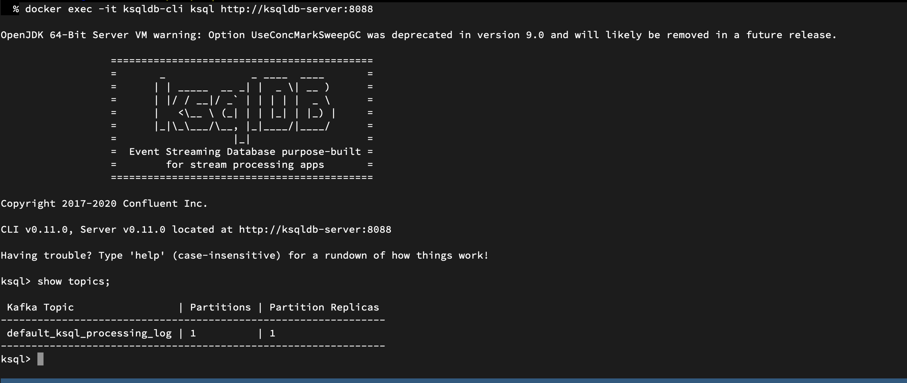

# This is a basic tutorial for KSQL.
## To start using ksql you have two choices.
* Use IBM cloud event stream service:
    * For this you need:
        1. Bootstrap server url
        1. Api key
        ### Export environment using 
        ```bash
        export KAFKA_BOOTSTRAP_SERVERS=<bootstrap-server>
        export KAFKA_API_KEY=<api-key>
        ```
        ```bash
        docker-compose -f docker-compose-remote.yaml up
        ```
         you should see 2 docker instance running 
        * ksqldb-cli
        * ksqldb-server
        now you can execute ksql command using
        ```bash
        docker exec -it ksqldb-cli ksql http://ksqldb-server:8088
        ```
* Use local kafka:
    * For this you need:
        ```bash
        docker-compose -f docker-compose-local.yaml up
        ```
        This will run kafka and ksqldb and ksql-cli as docker container
        you can see docker container using
        ```bash
        docker ps -a 
        ```
        you should see 4 docker instance running 
        * ksqldb-cli
        * ksqldb-server
        * ksql_kafka_1
        * ksql_zookeeper_1

        now you can execute ksql command using
        ```bash
        docker exec -it ksqldb-cli ksql http://ksqldb-server:8088
        ```
now you should be inside docker container and see ksql message 

you can type command such as :
```bash 
show topics;
show table;
```
